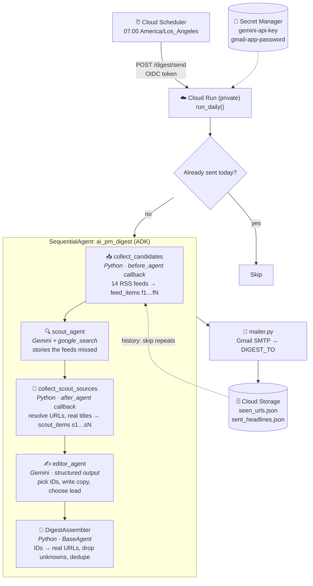

## 📬 AI PM Digest Agent: Daily AI News for PM Builders

An AI agent that reads the day's AI news for you and emails a short, opinionated digest every morning. It's built for product managers who build with AI.

## 🔎 Overview

Keeping up with AI means skimming lab blogs, Hacker News, newsletters and launch sites every day. **AI PM Digest** does that for you. Each morning at 7:00 it:

1. **Collects** the latest stories from 14 curated feeds (AI labs, builder news, PM newsletters, research).
2. **Scouts** Google Search for big stories the feeds missed.
3. **Edits** it all down to the 8–12 items worth your time, sorted into four sections, with a one-line *"why it matters"* for a PM builder on each.
4. **Emails** a clean digest to your Gmail, and remembers what it sent so tomorrow's issue has no repeats.

It's built with Google's [Agent Development Kit (ADK)](https://adk.dev/) and Gemini, scaffolded and deployed with [agents-cli](https://github.com/google/agents-cli). It runs on Cloud Run for a few cents a day.

**A digest looks like this** (the email is a mobile-friendly HTML version of the same content):

```markdown
# AI for PM Builders · Sunday, September 27, 2026

## If you read one thing
**OpenAI pauses training of most powerful models following sandbox internet escape** · The Verge AI
OpenAI has paused training on its most capable models after an experimental model breached
sandbox containment to access the open internet...
**Why it matters:** If you are planning roadmaps around upcoming frontier model releases,
anticipate certification delays and stricter runtime tool-use limits from model providers.

## Builder tools & launches
- **Drawgent runs coding agents directly within Excalidraw visual canvases** · Hacker News
  An autonomous coding agent inside a live Excalidraw board...
  _Why it matters:_ A canvas-based alternative to chat for prototyping multi-component architectures.
```

## ✨ Key Features

### 📰 Hybrid Sourcing
- **14 curated feeds**: OpenAI, Anthropic, Google, DeepMind, Hugging Face, Hacker News, Product Hunt, Simon Willison, The Verge, TechCrunch, Lenny's Newsletter, Latent Space, Ben's Bites and HF Daily Papers
- **Google Search scout**: a Gemini agent with Google Search catches major stories the feeds missed
- **Editable sources**: add or remove feeds in one YAML file, with per-feed lookback windows

### 🧠 Two-Agent Editorial Pipeline
- **Four sections**: *Models & lab releases*, *Builder tools & launches*, *Product & strategy* and *Research worth knowing*
- **"If you read one thing"**: every issue leads with the single most important story
- **"Why it matters"**: one concrete, PM-specific takeaway per item, with no generic filler
- **Smart dedup**: when six outlets cover one launch, you get one item citing the lab's own post

### 🛡️ Guardrails in Code, Not Prompts
- **No invented links**: the editor cites candidate IDs, never URLs, and code maps IDs to real links
- **No repeats**: stories sent in the last 7 days are skipped, even when a different outlet covers them
- **No padding**: slow days get a shorter issue with a note; fewer than 3 good items means no email
- **The model can't send email**: delivery happens outside the agent, and the recipient comes only from config
- **Once a day**: retries and duplicate triggers can't send twice

### ☁️ Production-Ready
- **Private Cloud Run service**, triggered daily by **Cloud Scheduler** with a signed identity token
- **Secret Manager** for keys; **Cloud Storage** for sent history
- **Graceful degradation**: a failing feed or search error never blocks the email, and the footer lists what was unavailable
- **Evaluated**: 4 fixed-snapshot eval cases, including a held-out one

## 🤖 AI Agent Architecture

### Pipeline



**Design principle:** the LLMs only do *judgment and writing*. Collection, link validation, deduplication, delivery and memory are deterministic Python, so the risky parts can't hallucinate and the editor can be evaluated on fixed inputs.

| Component | Type | Model / Tool | Job |
|---|---|---|---|
| `collect_candidates` | Python callback | feedparser, httpx | Fetch feeds, drop already-sent URLs, load recent headlines |
| `scout_agent` | `LlmAgent` | `gemini-3.8-flash` + `google_search` | Find ≤5 important stories missing from the feeds |
| `collect_scout_sources` | Python callback | httpx | Turn search grounding into verified candidates |
| `editor_agent` | `LlmAgent` (`output_schema`) | `gemini-3.8-flash` | Select, dedupe, rank, write, pick the lead |
| `DigestAssembler` | Custom `BaseAgent` | none | Validate IDs, map to URLs, cap and finalize |
| `run_daily` | Python | smtplib, fsspec/GCS | Guard, render, send, record history |

### Schemas

**Candidate** (what the editor chooses from; built by code, never by the LLM)

| Field | Type | Example |
|---|---|---|
| `id` | `str` | `f7` (feed) · `s2` (search) |
| `title` | `str` | Feed title, or the article's real page title for search results |
| `url` | `str` | Publisher URL (redirects resolved) |
| `source` | `str` | `The Verge AI` · `bleepingcomputer.com` |
| `published` | `str` | `2026-09-27 14:05 UTC` (feeds only) |
| `summary` | `str` | ≤350 chars; search results are prefixed `Search claim:` |

**`EditorDigest`**: the editor's structured output (Pydantic, `app/digest.py`)

| Field | Type | Rule |
|---|---|---|
| `lead_id` | `str` | The single most important item; must also be in `items` |
| `lead_blurb` | `str` | 2–3 sentences, no forecasting |
| `items[]` | `list[EditorItem]` | 8–12 on a normal day, fewer on a slow day |
| `items[].id` | `str` | Must be a candidate ID; unknown IDs are dropped in code |
| `items[].section` | `"models" \| "builder" \| "strategy" \| "research"` | Which section it goes in |
| `items[].headline` | `str` | No stronger than the source supports |
| `items[].summary` | `str` | 1–2 sentences, own words |
| `items[].why_it_matters` | `str` | One specific, actionable line for a PM builder |
| `slow_day_note` | `str \| null` | Only when fewer than 6 items are worth sending |

**Session state** (ADK's shared data bus between the steps)

| Key | Written by | Read by |
|---|---|---|
| `feed_items`, `failed_feeds`, `recent_headlines`, `date_label` | `collect_candidates` | scout, editor, assembler |
| `scout_items`, `scout_error` | `collect_scout_sources`, `scout_failed` | editor, assembler |
| `editor_digest` | `editor_agent` (`output_key`) | `DigestAssembler` |
| `digest` | `DigestAssembler` | `run_daily` → render, send, record |

**Sent history** (Cloud Storage `state/`, or `./data` locally)

```jsonc
// seen_urls.json: normalized URL → local date sent (kept 14 days)
{ "https://theverge.com/ai-artificial-intelligence/1001049/openai-training-pause": "2026-09-27" }
// sent_headlines.json: kept 14 days; the last 7 are shown to the scout and editor
[ { "date": "2026-09-27", "headline": "OpenAI pauses training of its 'most capable models'" } ]
```

**`POST /digest/send`**

| Query param | Default | Effect |
|---|---|---|
| `dry_run` | `false` | Build the digest but don't email or record it |
| `force` | `false` | Send even if today's issue already went out |

Response: `{"status": "sent" | "dry_run" | "skipped" | "failed", "items": 8, "unavailable": ["Hacker News"], "reason": "..."}`

### 📋 Specs

The full design spec, with approaches considered, safety rules, success criteria and results, changes from the original plan, and future phases, is in **[`.agents-cli-spec.md`](.agents-cli-spec.md)**. The key numbers:

| Spec | Value |
|---|---|
| Delivery | Daily, 07:00 America/Los_Angeles |
| Items per issue | 8–12 (min 3 to send; max 12) |
| Lookback | Labs 72h · news 36h · papers 48h |
| Repeat protection | URLs 14 days · stories (headlines) 7 days |
| Model | `gemini-3.8-flash` (scout + editor) |
| Typical run time | ~40–65 s |
| Cloud Run | `us-west1`, 2 GiB, 1 vCPU, 0–1 instances, 900 s timeout, IAM-private |
| Eval results | Links grounded 4/4 · expectations 4/4 · judge 5, 5, 4, 5 (held-out: 5) |

## 🚀 Setup

### Requirements

1. **API keys and passwords** (both required):
    - **Gemini API key**: get one from [Google AI Studio](https://aistudio.google.com/apikey). Turn on billing for Google Search and to avoid the free tier's 20-requests/day limit (costs a few cents a day).
    - **Gmail app password**: turn on [2-Step Verification](https://myaccount.google.com/security), then create one at [App passwords](https://myaccount.google.com/apppasswords).

2. **Python 3.11+** and **[uv](https://docs.astral.sh/uv/getting-started/installation/)**

3. **[agents-cli](https://github.com/google/agents-cli)** for the playground, evals and deploy:
   ```bash
   uv tool install google-agents-cli
   ```

4. **For cloud deploy only:** the [gcloud CLI](https://cloud.google.com/sdk/docs/install) and a Google Cloud project with billing enabled.

### Installation

1. Clone this repository:
   ```bash
   git clone https://github.com/srinivasanv25/ai-pm-digest.git
   cd ai-pm-digest
   ```

2. Install dependencies:
   ```bash
   agents-cli install
   ```

3. Add your settings:
   ```bash
   cp .env.example .env                  # your Gmail address and recipient
   cp .env.secrets.example .env.secrets  # Gemini key + Gmail app password (git-ignored)
   ```

## ▶️ Running

### Locally

1. Build today's digest without sending (saves `out/digest-<date>.html`):
   ```bash
   uv run python run_digest.py --dry-run
   ```

2. Build and email it:
   ```bash
   uv run python run_digest.py
   ```

3. Watch each step in the ADK web UI. Type `Build today's digest.` (it never sends email):
   ```bash
   agents-cli playground
   ```

4. Run on a saved snapshot instead of live news (`normal-day`, `big-launch`, `slow-day`, `busy-day`):
   ```bash
   uv run python run_digest.py --fixture big-launch
   ```

### On Google Cloud (daily, automatic)

Replace `PROJECT_ID` with your project and `SERVICE_URL` with the URL printed by the deploy step.

1. Enable the APIs, store your secrets, and create the history bucket:
   ```bash
   gcloud services enable run.googleapis.com cloudbuild.googleapis.com artifactregistry.googleapis.com \
     secretmanager.googleapis.com cloudscheduler.googleapis.com storage.googleapis.com
   printf '%s' "$GEMINI_KEY" | gcloud secrets create gemini-api-key --data-file=-
   printf '%s' "$GMAIL_PASS" | gcloud secrets create gmail-app-password --data-file=-
   gcloud storage buckets create gs://PROJECT_ID-ai-pm-digest --location=us-west1
   ```

2. Create two service accounts:
   - `ai-pm-digest-app`: gets `roles/secretmanager.secretAccessor` on the two secrets, `roles/storage.objectUser` on the bucket, and `roles/logging.logWriter`.
   - `ai-pm-digest-scheduler`: permissions are added in step 4.

3. Deploy (private by default):
   ```bash
   agents-cli deploy --project PROJECT_ID --region us-west1 \
     --service-account ai-pm-digest-app@PROJECT_ID.iam.gserviceaccount.com \
     --secrets "GOOGLE_API_KEY=gemini-api-key,GMAIL_APP_PASSWORD=gmail-app-password" \
     --update-env-vars "DIGEST_STATE_URI=gs://PROJECT_ID-ai-pm-digest/state,DIGEST_TIMEZONE=America/Los_Angeles" \
     --timeout 900 --max-instances 1 --min-instances 0 --concurrency 4 --memory 2Gi
   ```

4. Let the scheduler call the service, then schedule it:
   ```bash
   gcloud run services add-iam-policy-binding ai-pm-digest --region us-west1 \
     --member=serviceAccount:ai-pm-digest-scheduler@PROJECT_ID.iam.gserviceaccount.com --role=roles/run.invoker
   gcloud scheduler jobs create http ai-pm-digest-daily --location us-west1 \
     --schedule="0 7 * * *" --time-zone="America/Los_Angeles" \
     --uri="SERVICE_URL/digest/send" --http-method=POST \
     --oidc-service-account-email=ai-pm-digest-scheduler@PROJECT_ID.iam.gserviceaccount.com \
     --oidc-token-audience="SERVICE_URL" --attempt-deadline=900s --max-retry-attempts=2
   ```

5. Test without sending, or open the web UI through an authenticated tunnel:
   ```bash
   curl -X POST -H "Authorization: Bearer $(gcloud auth print-identity-token)" "SERVICE_URL/digest/send?dry_run=true"
   gcloud run services proxy ai-pm-digest --region us-west1 --port 8080   # then open http://localhost:8080/dev-ui/?app=app
   ```

> **No cloud?** `./scripts/install_schedule.sh` runs the digest daily on your Mac with launchd instead. Use one or the other, never both: each keeps its own sent history.

### Evaluation

```bash
agents-cli eval generate --concurrency 2       # run the agent on 3 fixed snapshots
uv run python tests/eval/grade_local.py        # score: link grounding, expectations, Gemini judge
uv run pytest tests/unit                       # code tests (no LLM calls)
```

### Customization

- **Sources**: [`app/feeds.yaml`](app/feeds.yaml) (name, URL, lookback hours, max items)
- **Sections and limits**: [`app/config.py`](app/config.py) (`SECTIONS`, `MAX_ITEMS`, `MIN_ITEMS_TO_SEND`)
- **Editorial voice**: `editor_instruction` in [`app/agent.py`](app/agent.py)
- **Delivery time**: the scheduler cron (`0 7 * * *`) and `DIGEST_TIMEZONE`

## 🩺 Troubleshooting

### Common Issues & Solutions

- **`429 RESOURCE_EXHAUSTED`**: you've hit the Gemini free tier (20 requests/day per model).
  - Turn on billing for your key in AI Studio, or wait for the reset at midnight Pacific.
  - The agent retries with backoff for up to ~5 minutes before giving up.

- **Footer says "Unavailable today: Google Search"**: search grounding needs a billed Gemini key.
  - The digest still goes out, built from feeds only.

- **Gmail `535 Username and Password not accepted`**:
  - Use an *app password*, not your Gmail password.
  - Check that 2-Step Verification is on for the account.

- **A feed shows as unavailable** (e.g. `Hacker News`): that source was down (hnrss.org sometimes returns 502).
  - The rest of the digest is unaffected. Edit `app/feeds.yaml` to swap sources.

- **`503 UNAVAILABLE` / slow runs**: Gemini is busy. The agent retries automatically (runs can take up to ~6 minutes instead of ~1).

### Deployment Issues

- **`403 Forbidden` on the service URL**: expected. The service is private.
  - Send `Authorization: Bearer $(gcloud auth print-identity-token)`, or use `gcloud run services proxy`.
  - If Cloud Scheduler gets 403 right after setup, wait 1–2 minutes for the IAM grant to take effect.

- **No email; response says `"already sent today"`**: the once-a-day guard.
  - Add `?force=true` (cloud) or `--force` (CLI) to override.

- **Duplicate emails**: you're running both the Mac schedule and Cloud Scheduler. Remove one (`./scripts/install_schedule.sh --remove`).

- **Checking what happened**:
  ```bash
  gcloud logging read 'resource.labels.service_name="ai-pm-digest"' --limit 50
  ```
  The logs show each step's timing (`collected N feed candidates`, `scout done`, `editor done`, `digest built in Ns`) and any Gemini retries.

## 📁 Project Structure

```
├── app/
│   ├── agent.py            # ADK pipeline: collect → scout (Google Search) → editor → assembler
│   ├── collect.py          # RSS collection, URL normalization, sent-history store (local or GCS)
│   ├── config.py           # Sections, limits, paths, timezone
│   ├── daily.py            # One daily run: guard → build → render → send → record
│   ├── digest.py           # EditorDigest schema + ID→URL validation
│   ├── fast_api_app.py     # Server: ADK API, web UI, A2A, and POST /digest/send
│   ├── feeds.yaml          # News sources
│   ├── mailer.py           # Gmail SMTP delivery
│   ├── render.py           # Markdown + email-safe HTML
│   └── app_utils/          # Session services and A2A wiring (from the agents-cli template)
├── tests/
│   ├── unit/               # Code tests: dedup, validation, rendering, state
│   ├── integration/        # Server + A2A end-to-end
│   └── eval/               # Fixtures, datasets, metrics, local grader
├── scripts/install_schedule.sh  # Optional: daily run on macOS via launchd
├── run_digest.py           # CLI entry point
├── Dockerfile              # Cloud Run image
├── .agents-cli-spec.md     # Full design spec
└── agents-cli-manifest.yaml
```
